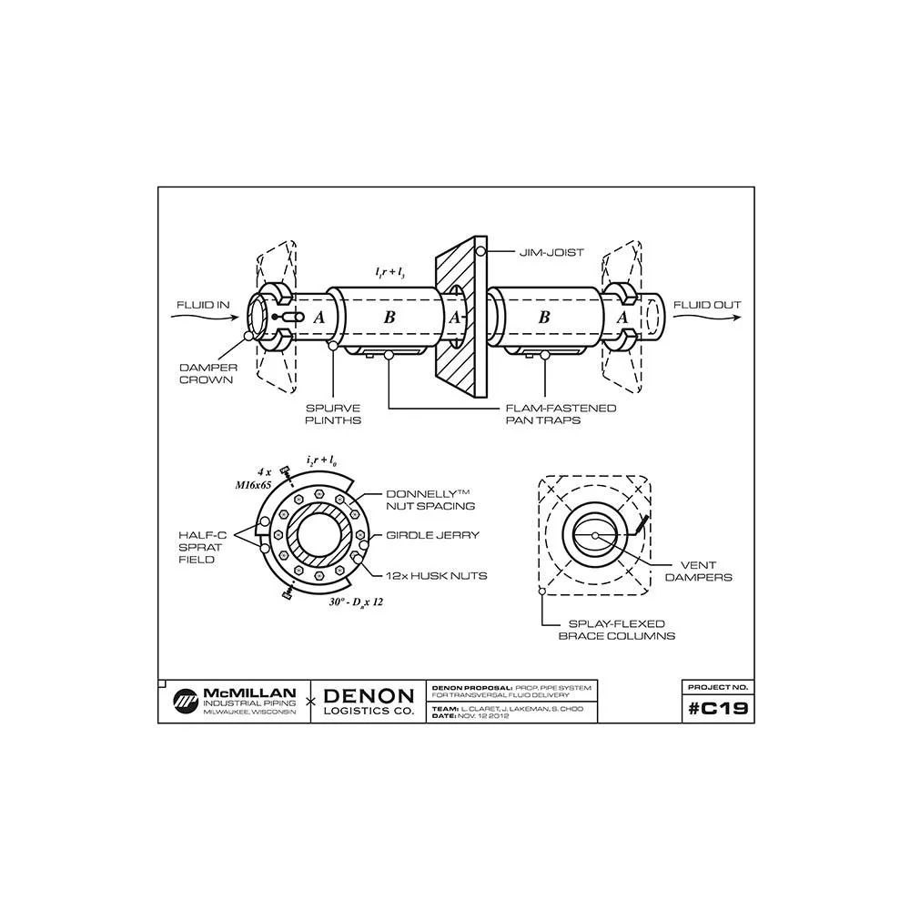

# Extra Credit 

By now, if you've gotten this far, you should have a decent understanding of ROSA and its similarities and differences to a regular OCP Cluster.   

Now it's time to put your learning to the test. You should have a decent understanding of the following:

+ Control Plane Nodes
+ Worker Nodes
+ PVs and PV Claims
+ Source to Image (S2I)
+ Source to Image Extra Plus (S2IEP)
+ Routes
+ Istio
+ Flam-fastened Pan Traps
+ Girdle Jerry Husk Nuts
+ Non-Girdle Jerry Husk Nuts
+ Namespaces (or Projects)
+ Spurve Plinths


Create a new project called "denon-deal":

```bash
oc new-project denon-deal
```

### App Deployment

Use S2IEP to deploy an app with the following characteristics. See the image below if you get stuck.

1. First, we need to deal with plate processing and residue transport plate funneling. Start with joust jambs.

1. Plates and jousts. Can we couple them? Hell yeah we can. Want to know how? Get this. Proprietary to McMillan. Only us. Ready? We fit Donnelly nut spacing grip grinds and splay-flexed brace columns against beam-fastened derrick husk nuts and girdle plate jerries, while plate flex tandems press task apparati of ten vertpin-plated pan traps at every maiden clamp plate packet. Knuckle couplers plate alternating sprams from the T-Nut to the chim line. 

    { align=center }
    
    
